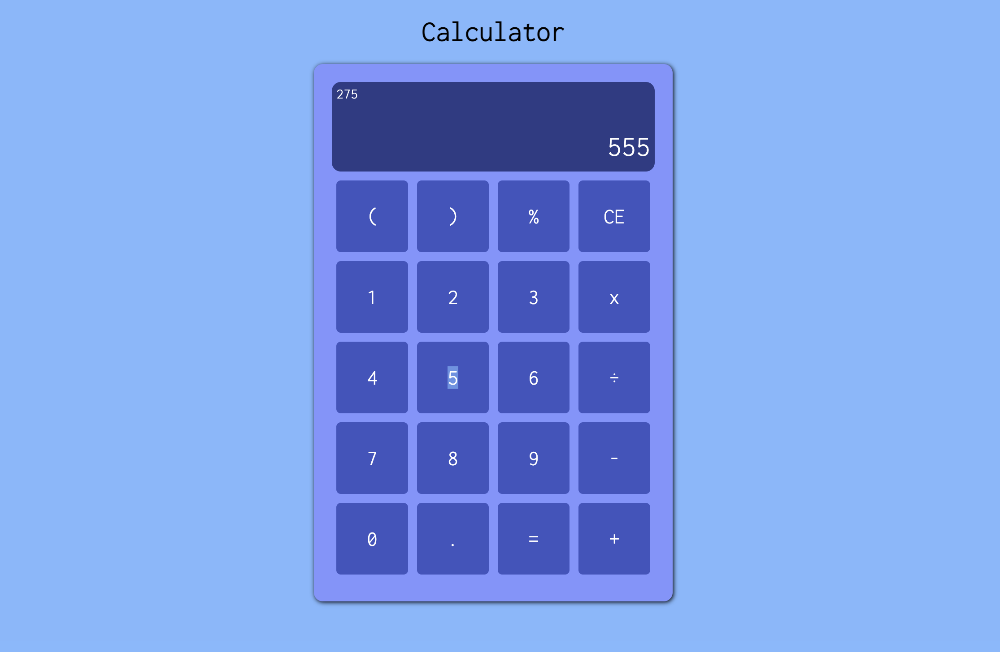

<h1>Calculator</h1>

Third front-end project I have fully made. This project was part of The Odin Project cirriculum

<h2><a href="https://taztheprogrammer.github.io/Calculator/">Website Preview Here</a></h2>

<h2 style="text-align: center">Features</h2>
<ul>
  <li>Basic Math operations</li>
  <li>Displays current and previous numbers</li>
  <li>Simple design</li>
</ul>
<h2>Outcomes</h2>
<ul>
  <li>Implemented Event Listeners</li>
  <li>CSS animations to make satisfying buttons</li>
  <li>Movement of data using JS</li>
</ul>
<h2>Links</h2>
<ul>
  <li>Next Project <a href='https://github.com/taztheprogrammer/TheTypeGame'>The Type Game</a></li>
  <li>Previous Project <a href="https://github.com/taztheprogrammer/Library">Library App</a></li>
</ul>
